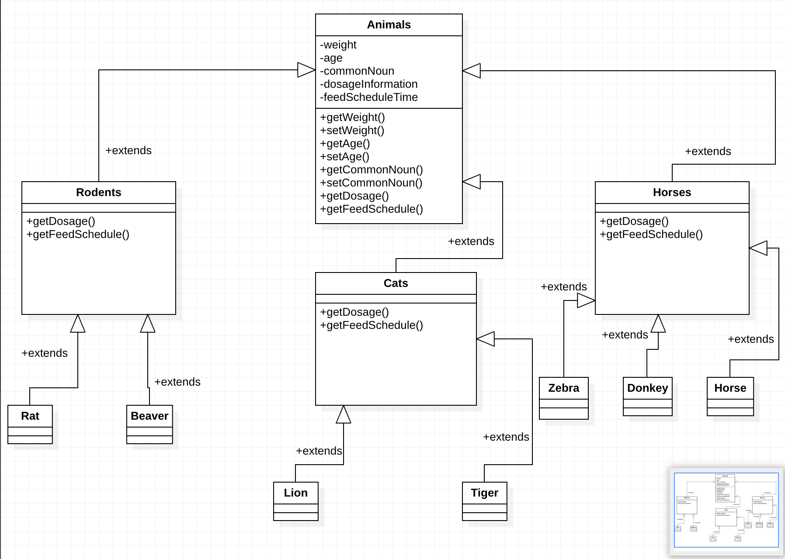

# Zoo-Uml-Design

[Patika.dev](https://www.patika.dev/tr)

Hayvanat Bahçesi Yönetim Sistemininin belirtilen kriterlece UML gösteriminin yapıldığı projedir.

---

Hayvanat bahçesi yönetim sistemine dair bizlerden istenen özellikle aşağıda ki gibidir.

```
Bir hayvanat bahçesindeki hayvanlar hakkındaki bilgileri takip etmek için bir sistem tasarlıyorsunuz.

Hayvanlar:
Atlar (atlar, zebralar, eşekler vb.),
Kedigiller (kaplanlar, aslanlar vb.),
Kemirgenler (sıçanlar, kunduzlar vb.) gibi gruplardaki türlerle karakterize edilir.
Hayvanlar hakkında depolanan bilgilerin çoğu tüm gruplamalar için aynıdır.
tür adı, ağırlığı, yaşı vb.
Sistem ayrıca her hayvan için belirli ilaçların dozajını alabilmeli => getDosage ()
Sistem Yem verme zamanlarını hesaplayabilmelidir => getFeedSchedule ()
Sistemin bu işlevleri yerine getirme mantığı, her gruplama için farklı olacaktır. Örneğin, atlar için yem verme algoritması farklı olup, kaplanlar için farklı olacaktır.

Polimorfizm modelini kullanarak, yukarıda açıklanan durumu ele almak için bir sınıf diyagramı tasarlayın.
```

---

Yukarıda ki istenen özelliklere göre Hayvanat Bahçesi Yönetim Sistemi projesinin UML-Design'i aşağıdaki gibidir.

Görselin altında bu design'a ait açıklamalar da yer almaktadır.



## UML-Design'a Ait Açıklamalar

1. Animals class’ına ait setter ve getter metotların eklenmesine dikkat edilmiştir.

2. Class’lara eklenen attribute’ların encapsulation ilkesine göre eklenmesine dikkat edilmiştir.

3. Atlar, kediler ve kemirgenler Ağırlık ve Yaş attribute’larını ve bunları set ve get eden metotları Animal Class’ından miras (Inheritance) almaktadırlar.

4. getDosage ve getFeedSchedule metodları gruplar arasında farklılık göstereceğinden UML şemasında miras alınan super class’dan override edildiği ifade edilmiştir.

5. Bir gruba ait alt sınıfların altlarında ki class’ların(Örneğin atlar grubu), bu gruptan miras aldığı UML diyagramında belirtilmiştir.

6. Gruplar bu metotları override ettiği için, daha doğrusu ilgili maddede bizden getDosage ve getFeedSchedule metotlarının gruplar için farklılık gösterdiği belirtildiğinden bu class’lardan kalıtım alan subclass’ların içerisinde bir metot veya attribute eklenmemiştir.